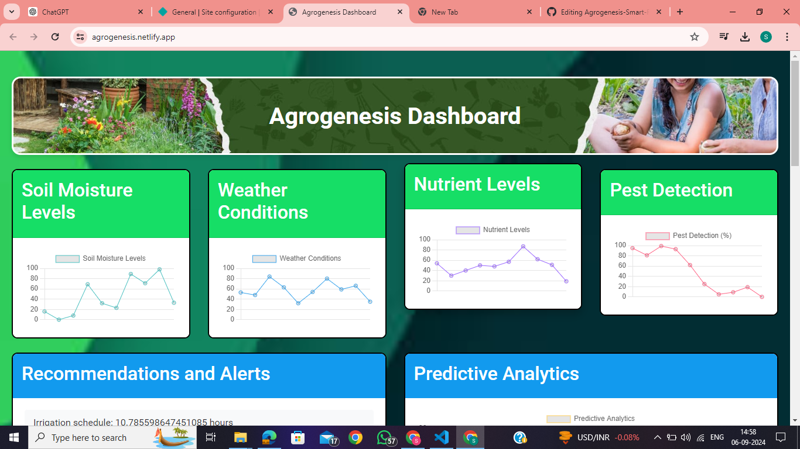
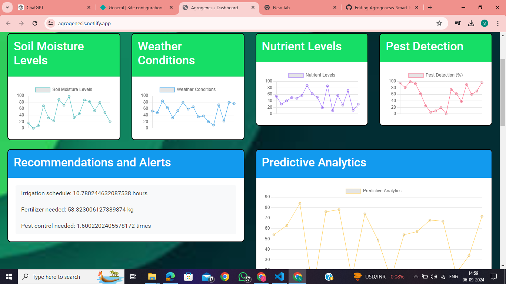
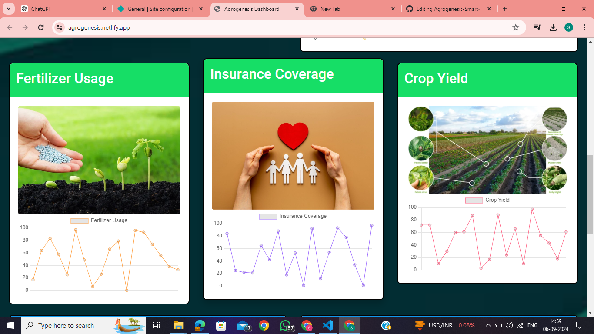
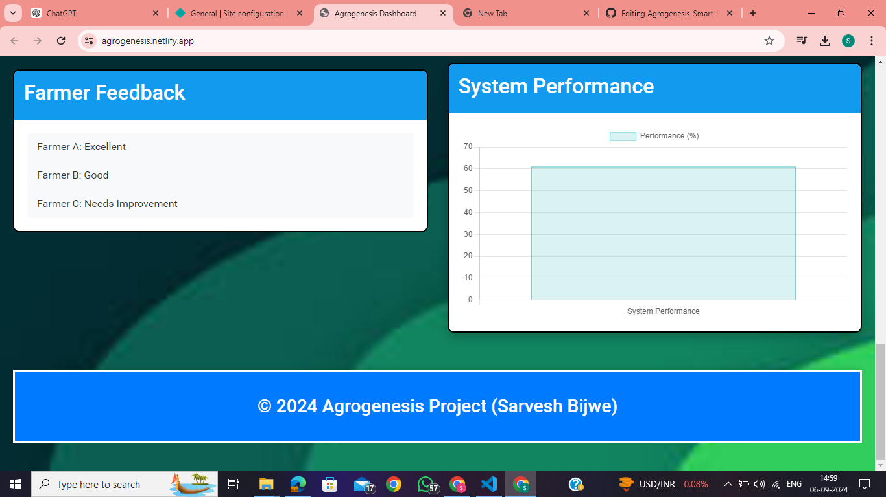

# Agrogenesis - Smart Farm Management Dashboard

Agrogenesis is a web-based solution developed to empower farmers with real-time insights into their farms, enabling smart decisions for better productivity and sustainability. This project integrates data analysis and modern technologies to help monitor farm conditions, recommend fertilizers, and track insurance claims efficiently.

## 🌱 Key Features
- **Real-time Crop and Soil Monitoring**: Provides up-to-date information about the health of crops and soil, helping farmers make data-driven decisions.
- **Smart Fertilizer Recommendations**: Suggests the best fertilizers for optimal yield based on soil conditions and crop needs.
- **Insurance Claim Tracking**: Allows farmers to manage and track their insurance claims for farm-related risks such as weather or pests.
- **User-friendly Interface**: Built using HTML, CSS, and JavaScript for a smooth and responsive user experience.

## 🔗 Project Technologies
- **Frontend**: HTML, CSS, JavaScript
- **Backend Logic**: JavaScript
- **AI-driven Analytics**: Smart insights for better decision-making

## 🚀 Getting Started

### Prerequisites
To run this project locally, you only need a modern web browser like Chrome, Firefox, or Edge.

### Installation
1. Clone the repository to your local machine:
   ```bash
   git clone https://github.com/sarveshbijwe/Agrogenesis-Smart-Farm-Dashboard.git
   cd Agrogenesis-Smart-Farm-Dashboard
## 📸 Screenshots
### Crop Monitoring

### Fertilizer Recommendations

### Insurance Claims Tracking

### Insurance Claims Tracking


## 🤝 Contributing
Contributions, issues, and feature requests are welcome!
Feel free to check the [issues page](https://github.com/sarveshbijwe/Agrogenesis-Smart-Farm-Dashboard/issues) or make a pull request.

## ⚖️ License
This project is licensed under the MIT License. See the [LICENSE](LICENSE) file for details.

## 👤 Authors
**Sarvesh** - Developer and Project Owner  
[LinkedIn Profile](https://www.linkedin.com/in/sarveshbijwe)

